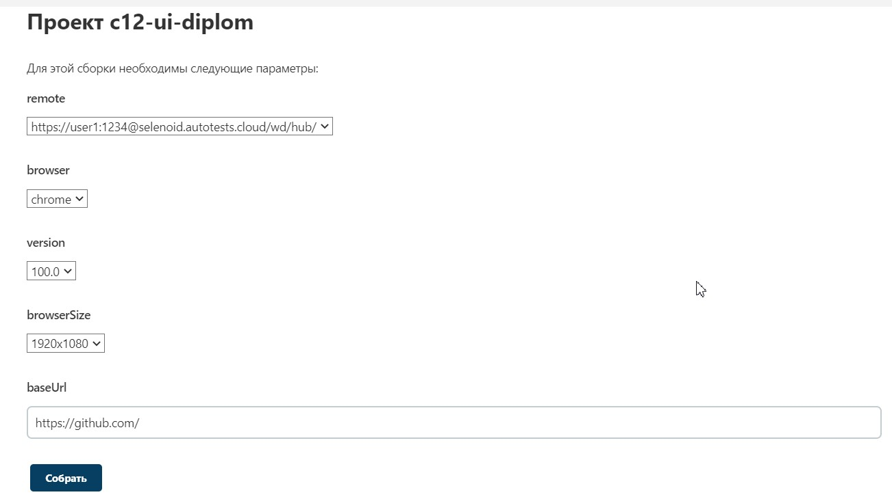
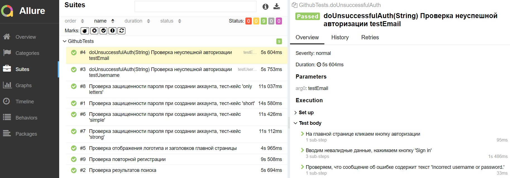
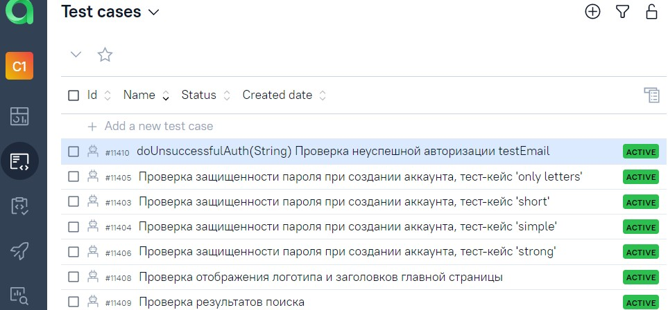
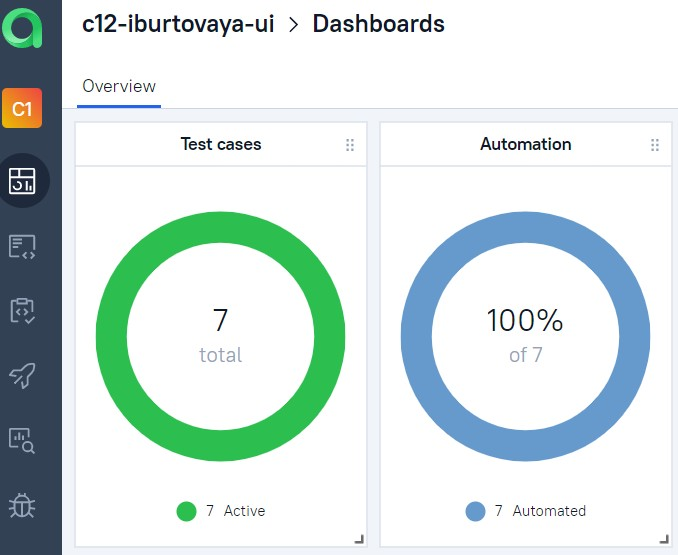
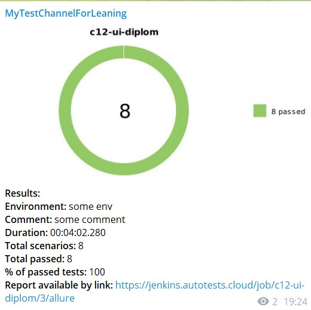

## ✨ Проект автоматизации тестирования UI сайта github.com
#### Проект создан в рамках обучения в школе QA.GURU и представляет из себя часть выпускной работы.
### <a target="_blank" href="https://qa.guru/">Перейти на сайт школы</a>

### 💎Содержание:

- <a href="#технологии-и-инструменты">Технологии и инструменты</a>
- <a href="#реализованные-проверки">Реализованные проверки</a>
- <a href="#сборка-в-jenkins">Сборка в Jenkins</a>
- <a href="#запуск-из-терминала">Запуск из терминала</a>
- <a href="#allure-отчет">Allure отчет</a>
- <a href="#Allure-TestOps-отчет">Allure TestOps отчет</a>
- <a href="#отчет-в-telegram">Отчет в Telegram</a>

### 💎[Технологии и инструменты](#технологии-и-инструменты)

### 💎[Реализованные проверки](#реализованные-проверки)
* Проверка защищенности пароля при создании аккаунта, тест-кейс 'short'.
* Проверка защищенности пароля при создании аккаунта, тест-кейс 'simple'.
* Проверка защищенности пароля при создании аккаунта, тест-кейс 'only letters'.
* Проверка защищенности пароля при создании аккаунта, тест-кейс 'strong'.
* Проверка отображения логотипа и заголовков главной страницы.
* Проверка результатов поиска.
* Проверка неуспешной авторизации.

### 💎[Сборка в Jenkins](#сборка-в-jenkins)
#### <a target="_blank" href="https://jenkins.autotests.cloud/job/c12-ui-diplom/">Перейти на сборку</a>
Сборки удобно делать с параметрами:

### 💎[Запуск из терминала](#запуск-из-терминала)
* #### Локальный запуск тест-кейсов
gradle clean test

* #### Удаленный запуск тест-кейсов
clean test  
-Dremote=${remote}   
-Dversion=${version}  
-DbrowserSize=${browserSize}  
-DbaseUrl=${baseUrl}

### 💎[Allure отчет](#allure-отчет)
#### Сводные данные

#### Тест-кейсы

### 💎[Allure TestOps отчет](#Allure-TestOps-отчет)
#### Тест-кейсы

#### Dashboard

### 💎[Отчет в Telegram](#отчет-в-telegram)
Для быстрого реагирования на результаты прохождения тест-кейсов, на проекте настроены быстрые уведомления в Telegram.
Уведомления выглядят следующим образом:

❤️ <a target="_blank" href="https://qa.guru">qa.guru</a> 
💙 <a target="_blank" href="https://t.me/qa_guru_chat">t.me/qa_guru_chat</a>